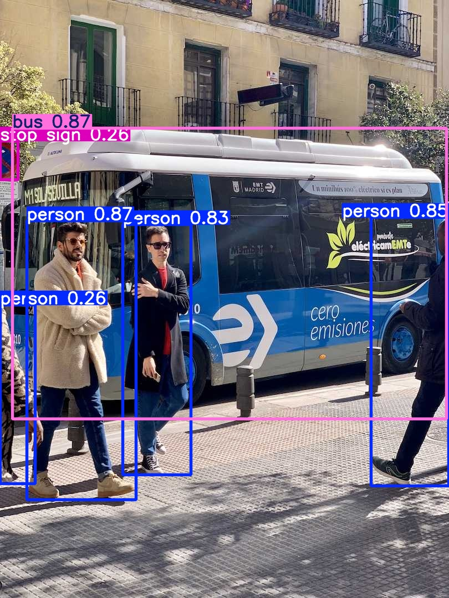

# YOLO Object Detection

Computer Vision project using YOLOv8 and Python for object detection.

## Project Overview

This project demonstrates object detection using a pretrained YOLOv8 model from Ultralytics.

The model identifies multiple objects in an image, generates bounding boxes, and provides confidence scores for each prediction.

## Technologies

- Python
- YOLOv8
- Ultralytics
- Computer Vision
- Google Colab
- Matplotlib
- PIL

## Features

- Object detection using YOLOv8
- Bounding box generation
- Confidence score evaluation
- Multiple image inference
- Detection result visualization

## Results

### Example Detection



Detected objects include:

- Person
- Bus
- Stop Sign
- Tie

The model successfully generated bounding boxes and confidence scores for each detected object.

## Repository Structure

```text
YOLO-object-detection
│
├── README.md
├── notebooks
│   └── yolo_object_detection.ipynb
└── images
    └── sample_detection.jpg
```

## Future Improvements

- Custom dataset training
- Real-time webcam detection
- YOLO deployment on NVIDIA Jetson
- Video object detection

## Author

Sebastián Díaz

Electrical Engineer | Data Scientist | ML & AI Engineer

Sebastián Díaz

Electrical Engineer | Data Scientist | ML Engineer
